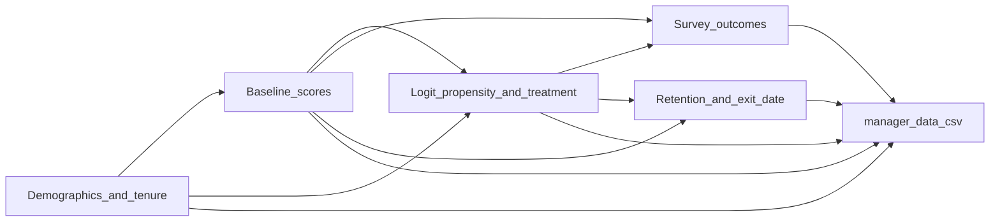

# Ground truth: mock manager dataset

This document records the **data-generating process (DGP)** implemented in `[generate_data.py](generate_data.py)`. Use it to verify **schema**, **structural invariants**, and **encoded treatment parameters** when checking `manager_data.csv`. It separates **fixed code parameters** from **stochastic realizations** (actual counts after Bernoulli draws, calibrated intercept).

---

## 1. Purpose, reproducibility, and outputs

| Item                  | Ground truth                                                                             |
| --------------------- | ---------------------------------------------------------------------------------------- |
| Generator             | `[data/generate_data.py](generate_data.py)`                                              |
| Random seed           | `SEED = 42`; `np.random.seed(42)` — reproducible draws ([lines 32–33](generate_data.py)) |
| Primary export        | `./data/manager_data.csv` ([line 607](generate_data.py))                                 |
| Descriptives workbook | `./data/data_descriptives.xlsx` ([lines 743, 1029](generate_data.py))                    |

**Design targets (not exact after randomization):** `N_TREATED_TARGET = 500` treated in expectation via propensity calibration ([lines 36–37, 135–146](generate_data.py). Actual `treatment` counts and sample means will differ slightly from these targets.

---

## 2. Sample design

| Parameter              | Value                                                                                                            | Code                                                      |
| ---------------------- | ---------------------------------------------------------------------------------------------------------------- | --------------------------------------------------------- |
| Population size        | `N_TOTAL = 9000`                                                                                                 | [lines 36–37, 69](generate_data.py)                       |
| Treated count (target) | ~500 expected treated (sum of propensities)                                                                      | [lines 37, 135–146](generate_data.py)                     |
| Clustering             | `team_id`: within-`organization`, random team sizes **5–12** (remainder may form one smaller final team per org) | [lines 397–411](generate_data.py)                         |
| Manager IDs            | `id` = 1 … `N_TOTAL`                                                                                             | [line 69](generate_data.py), [line 425](generate_data.py) |

---

## 3. Covariate distributions (inputs)

All draws use the seeded RNG ([line 33](generate_data.py)).

| Variable             | Distribution / rule                                                                       | Code                                |
| -------------------- | ----------------------------------------------------------------------------------------- | ----------------------------------- |
| `region`             | Uniform over 5 regions                                                                    | [line 40](generate_data.py), [line 72](generate_data.py) |
| `organization`       | Uniform over 6 organizations                                                              | [line 41](generate_data.py), [line 73](generate_data.py) |
| `job_family`         | Uniform over 15 job families                                                              | [lines 42–47](generate_data.py), [line 74](generate_data.py) |
| `performance_rating` | Categorical with probabilities `[0.05, 0.15, 0.60, 0.15, 0.05]` (Far Below … Far Exceeds) | [lines 48, 76–77](generate_data.py) |
| `gender`             | `[0.48, 0.48, 0.04]`                                                                      | [lines 49, 79–80](generate_data.py) |
| `age`                | `Normal(38, 6)`, clipped to **25-60**, integer                                            | [line 83](generate_data.py)         |
| `tenure_months`      | `Gamma(3, 4)`, clipped to **1–120**, integer                                              | [line 84](generate_data.py)         |

---

## 4. Other baseline scores and scale

| Variable                      | Generative rule                                                   | Code                                   |
| ----------------------------- | ----------------------------------------------------------------- | -------------------------------------- |
| `baseline_manager_efficacy`   | `generate_baseline(3.3, 0.85)` → Normal, rounded, clipped **1–5** | [lines 93–100](generate_data.py)       |
| `baseline_workload`           | `generate_baseline(3.0, 0.95)`                                    | [lines 93–100](generate_data.py)       |
| `baseline_stay_intention`     | `generate_baseline(2.7, 1.00)`                                    | [lines 93–100](generate_data.py)       |
| Likert bounds                 | `SURVEY_MIN = 1`, `SURVEY_MAX = 5`                                | [lines 51–52](generate_data.py)        |

---

## 5. Treatment and self-selection

### 5.1 Propensity model

Linear predictor: `**intercept` + `org_weight` + `perf_weight`**, with `p_treat = expit(...)`.

- `**intercept`:** Calibrated by **bisection** on `[-6, 2]` so that **sum of `p_treat` ≈ `N_TREATED_TARGET`** within **0.5** ([lines 135–146](generate_data.py)). The intercept is **not** a fixed constant in the spec; it is **data-dependent** (depends on realized covariates).

### 5.2 Organization weights (`org_weight`)

| Organization  | Weight |
| ------------- | ------ |
| R&D           | +0.90  |
| Digital       | +0.75  |
| Commercial    | 0.0    |
| Manufacturing | -0.20  |
| HR            | -0.10  |
| Finance       | -0.25  |

([lines 116–122](generate_data.py))

### 5.3 Performance weights (`perf_weight`)

| Performance rating | Weight |
| ------------------ | ------ |
| Far Exceeds        | +1.20  |
| Exceeds            | +0.60  |
| Meets              | 0.0    |
| Below              | -20.0  |
| Far Below          | -20.0  |

([lines 126–131](generate_data.py))

### 5.4 Assignment and constraints

1. `treatment` ~ Bernoulli(`p_treat`) ([lines 152–153](generate_data.py)).
2. **Hard constraint:** `Below` and `Far Below` → **never treated** (forced to 0) ([lines 155–156](generate_data.py)).
3. `**propensity_score` in the export** equals `**p_treat`** from the model (pre-draw probability) ([lines 162, 440](generate_data.py)).

**Invariant (must hold):** No row with `treatment == 1` and `performance_rating` in `{'Below', 'Far Below'}`.

---

## 6. Continuous outcomes (true DGP parameters)

Implemented in `generate_outcome_with_baseline` ([lines 172–216](generate_data.py)). Treatment adds `**treatment_effect_d * base_sd`** on the latent scale; optional **heterogeneous** add-ons `**hetero_extra_d * base_sd * treatment * hetero_mask`** and, for `manager_efficacy_index` only, a second term `**hetero_extra_d_2 * base_sd * treatment * hetero_mask_2`**. `hetero_mask` and `hetero_mask_2` may be binary 0/1 vectors *or* continuous values in [0, 1]. Outcomes are clipped to **[1, 5]** and rounded to one decimal ([lines 214–216](generate_data.py)).

For `**manager_efficacy_index`** only, two **continuous** HTE gradients are layered on top of the base effect:

- **Top HTE — `num_direct_reports`:** a linear gradient via `nd_reports_scaled = (num_direct_reports - 5) / 7` (ranges 0 at 5 reports → 1 at 12 reports, mean ≈ 0.50). The incremental Cohen’s *d* is **+0.15 × `nd_reports_scaled`** on the latent scale, so a manager with 12 direct reports gets a +0.15 *d* bonus on top of the base 0.33 *d*, while a manager with 5 direct reports gets no bonus. This is the strongest moderator by design.
- **Second HTE — low tenure:** a linear gradient via `low_tenure_scaled = clip(1 - tenure_months / 60, 0, 1)` (ranges 1 at 0 months → 0 at 60+ months, mean ≈ 0.80 because tenure is right-skewed). The incremental Cohen’s *d* is **+0.05 × `low_tenure_scaled`**, so a brand-new manager gets +0.05 *d* on top of the base and the direct-reports gradient, while a manager with 60+ months of tenure gets no tenure bonus.

Both gradients apply **only** to `manager_efficacy_index`. `workload_index_mgr` and `stay_intention_index_mgr` have **no HTE** (homogeneous effects by design).

| Column                         | `base_mean` | `base_sd` | Cohen’s `d` | `baseline_r` | Baseline vector                 | Heterogeneity                                                                                                                                   |
| ------------------------------ | ----------- | --------- | ----------- | ------------ | ------------------------------- | ----------------------------------------------------------------------------------------------------------------------------------------------- |
| `manager_efficacy_index`       | 3.4         | 0.90      | **0.33**    | 0.60         | `baseline_manager_efficacy`     | **`num_direct_reports`** (top): **+0.15 × `nd_reports_scaled`** extra *d*; **low tenure** (second): **+0.05 × `low_tenure_scaled`** extra *d*   |
| `workload_index_mgr`           | 3.2         | 1.00      | **0**       | 0.45         | `baseline_workload`             | — (no direct treatment term; outcome = baseline + noise)                                                                                        |
| `stay_intention_index_mgr`     | 2.8         | 1.00      | **0.10**    | 0.50         | `baseline_stay_intention`       | —                                                                                                                                               |

([lines 219–253](generate_data.py))

**Survey censoring:** `manager_efficacy_index`, `workload_index_mgr`, and `stay_intention_index_mgr` are set to **missing** when the manager does **not** remain through **6** months (`retention_6month == 0` in the internal DGP), i.e. they left in the first half of the year. Managers who leave later still have observed Likert outcomes in the export.

---

## 7. Binary retention

### 7.0 Two-stage retention (by design)

Retention is a **deliberate two-stage** DGP, not a single joint model (e.g. proportional hazards across all horizons).

- **Stage 1 — §7.1:** 0–3 month retention uses an **individual-level** logit (`generate_retention_with_baseline`): a baseline retention rate, treatment on the log-odds scale, and **centered `baseline_stay_intention`** as a covariate.
- **Stage 2 — §7.2:** Continuation from 3→6, 6→9, and 9→12 months uses **fixed, population-level** conditional survival probabilities (treated vs control in the table), calibrated to approximate **target cumulative** retention. This stage does **not** apply the same **row-specific** linear predictor as §7.1.

**Why two stages:** Early retention stays **covariate-rich**; later intervals stay **simple** so `exit_date` quarter assignment and cumulative targets remain easy to read and to teach. This is an intentional **tutorial** simplification, not a claim of one fully specified continuous-time survival model.

**Teaching note — non-proportional hazards (front-loaded effect):** The DGP **deliberately violates** proportional hazards. The treatment effect on the discrete-time hazard is **strong** in the 0–3 month interval (§7.1), **attenuates** in the 3–6 month interval (§7.2), and is **null** from 6 months onward. The expected period-specific hazard-ratio pattern is roughly **HR ≈ 0.27** (0–3 mo, highly significant), **HR ≈ 0.64** (3–6 mo, borderline), and **HR ≈ 1.0** (6–9 and 9–12 mo, null). The log-hazard-ratio is monotonically increasing toward zero over time, which should be detectable by a **Schoenfeld residual / Grambsch–Therneau test** and recoverable by a **time-interaction Cox model**.

### 7.1 Three-month retention

`generate_retention_with_baseline` ([lines 261–276](generate_data.py)); first-period draw ([lines 278–285](generate_data.py)):

- **Baseline retention rate:** `base_rate = 0.88` (slightly lower than the legacy value so there are enough control-arm events to power period-specific tests).
- **Treatment odds ratio:** `treatment_or = 4.0` (on log-odds scale) — a **large** early effect that dominates the 12-month cumulative gap.
- **Baseline covariate:** centered `baseline_stay_intention`, coefficient **0.30** on the logit scale ([lines 271–272](generate_data.py)).

Implied 3-month retention: treated ≈ **97%**, control ≈ **88%** (≈ 9 pp gap).

### 7.2 Six-, nine-, and twelve-month retention

Second stage (fixed conditional probabilities); see §7.0. Designed to **attenuate then null out** the treatment effect.

Conditional on surviving the previous period ([lines 290–311](generate_data.py)):

| Horizon            | Treated conditional survival | Control conditional survival | Period effect |
| ------------------ | ---------------------------- | ---------------------------- | ------------- |
| 6 mo (given 3 mo)  | `0.965`                      | `0.945`                      | borderline    |
| 9 mo (given 6 mo)  | `0.955`                      | `0.955`                      | null          |
| 12 mo (given 9 mo) | `0.955`                      | `0.955`                      | null          |

Implied **target cumulative** retention:

| Horizon | Treated | Control | Gap |
| ------- | ------- | ------- | --- |
|  3 mo   | ~97%    | ~88%    | ~9 pp |
|  6 mo   | ~93%    | ~83%    | ~10 pp |
|  9 mo   | ~89%    | ~79%    | ~10 pp |
| 12 mo   | ~85%    | ~76%    | ~9 pp |

The 12-month cumulative gap is **almost entirely inherited** from the 0–3 month stage — a clean example of why a single Cox hazard ratio can mask a strongly time-varying effect.

### 7.3 Monotonicity (structural)

The generator asserts ([lines 305–308](generate_data.py)):

- `retention_6month` ≤ `retention_3month`
- `retention_9month` ≤ `retention_6month`
- `retention_12month` ≤ `retention_9month`

(elementwise for all rows).

### 7.4 Export vs. internal flags

The **nested 3 / 6 / 9 / 12-month** retention structure above is **not** written to `manager_data.csv`. It remains in code for `exit_date` quarter assignment and for the Excel descriptives workbook. Analysts use `**exit_date`** (and survival columns derived in the workshop notebook) for retention timing.

---

## 8. `exit_date`

- Observation window: **2026-01-02** through **2026-12-31** ([lines 323–325](generate_data.py)).
- Leavers assigned to a **quarter bucket** from retention flags; date drawn uniform within quarter + Gaussian jitter (~10 days), reflected at bounds ([lines 348–365](generate_data.py)).
- **Retained** through 12 months: `exit_date` is **blank** (empty string).

---

## 9. Direct reports and span of control

| Column                | Rule                                                                                    | Code                              |
| --------------------- | --------------------------------------------------------------------------------------- | --------------------------------- |
| `num_direct_reports`  | Uniform integer **5–12** inclusive                                                      | [line 388](generate_data.py)      |
| `tot_span_of_control` | `num_direct_reports` + `Gamma(2, 5)` (rounded), clipped to **[num_direct_reports, 50]** | [lines 392–393](generate_data.py) |

**Invariant:** `tot_span_of_control` ≥ `num_direct_reports` ([lines 421–422](generate_data.py)).

---

## 10. Sanity checks (seed 42, approximate)

The script prints **expected ballpark** standardized mean differences for verification ([lines 585–610](generate_data.py)). These are **not** definitions of the DGP; they are **diagnostic expectations** under the default seed:

- **Manager efficacy (treated vs control, crude SMD):** ~**0.33–0.45** overall.
- **Top HTE (direct reports):** subgroup *d* is **larger for managers with high spans** (`num_direct_reports ≥ 9`) than for low spans (`≤ 6`). The low-span subgroup should be close to the base 0.33 *d*.
- **Second HTE (low tenure):** subgroup *d* is **slightly larger for tenure ≤ 6 months** than for tenure ≥ 24 months. The high-tenure subgroup should be close to the base 0.33 *d*.
- **Stay intention (treated vs control):** ~**0.10**.

Use these as loose QC bands when reproducing the pipeline with `SEED = 42`.

---

## 11. DGP flow (overview)

---

## 12. Final dataset: `manager_data.csv`

One row per manager. Columns appear **in this order** in the export ([lines 424–445](generate_data.py)). Types reflect the generator (`int` for IDs and flags unless noted; Likert outcomes **one decimal** on **1–5** where observed).

### Identifiers and design

| Column      | Description                                                                                                                               |
| ----------- | ----------------------------------------------------------------------------------------------------------------------------------------- |
| `id`        | Unique manager ID, integer **1 … 9000** ([lines 69, 425](generate_data.py)).                                                              |
| `team_id`   | Cluster ID for **within-organization** teams (see §2); used for clustered standard errors. Integer ≥ 1 ([line 426](generate_data.py)).    |
| `treatment` | **1** = voluntarily enrolled in the leadership development program; **0** = did not participate ([lines 152–153, 427](generate_data.py)). |

### Demographics and role

| Column                | Description                                                                                                                                                        |
| --------------------- | ------------------------------------------------------------------------------------------------------------------------------------------------------------------ |
| `region`              | One of five global regions (uniform draw; [line 428](generate_data.py)).                                                                                           |
| `organization`        | Business unit / org: R&D, Commercial, Manufacturing, Digital, HR, or Finance ([line 429](generate_data.py)).                                                       |
| `job_family`          | Functional job family (15 categories; [line 430](generate_data.py)).                                                                                               |
| `performance_rating`  | Prior performance category: Far Below, Below, Meets, Exceeds, or Far Exceeds ([line 431](generate_data.py)).                                                       |
| `gender`              | Male, Female, or Non-Binary/Other ([line 432](generate_data.py)).                                                                                                  |
| `age`                 | Age in **years** (integer, clipped range in DGP; see §3) ([line 433](generate_data.py)).                                                                           |
| `tenure_months`       | Tenure in **months** (integer; see §3) ([line 434](generate_data.py)).                                                                                             |
| `num_direct_reports`  | Number of direct reports (**5–12**; [line 435](generate_data.py)).                                                                                                 |
| `tot_span_of_control` | Total span including indirect reports; **≥** `num_direct_reports`, capped at **50** ([line 436](generate_data.py)).                                                |

### Prior-year baselines (1–5 Likert)

| Column                        | Description                                                                                                                                           |
| ----------------------------- | ----------------------------------------------------------------------------------------------------------------------------------------------------- |
| `baseline_manager_efficacy`   | Prior-year manager efficacy score: **1–5** with two decimals ([lines 98, 437–438](generate_data.py)).                                                |
| `baseline_workload`           | Prior-year workload: **1–5** with two decimals (**1–5**) ([line 438](generate_data.py)).                                                              |
| `baseline_stay_intention` | Prior-year stay intention: **1–5** with two decimals; coded so **higher = more intention to stay** ([lines 100, 271–272, 439](generate_data.py)). |

### Treatment model diagnostics

| Column             | Description                                                                                                                                          |
| ------------------ | ---------------------------------------------------------------------------------------------------------------------------------------------------- |
| `propensity_score` | Probability of treatment from the **logit** model **before** the Bernoulli draw, **rounded to 4 decimals** ([lines 440, 162](generate_data.py)). |

### Retention and exit

| Column      | Description                                                                                                                                                                                                                              |
| ----------- | ---------------------------------------------------------------------------------------------------------------------------------------------------------------------------------------------------------------------------------------- |
| `exit_date` | `**YYYY-MM-DD`** if the manager left during the observation window; **empty string** if retained at 12 months ([lines 348–365](generate_data.py)). The nested 3/6/9/12-month retention **logic** is §7 (not exported as binary columns). |

### Post-period survey outcomes (1–5 Likert)

| Column                         | Description                                                                                                                                             |
| ------------------------------ | ------------------------------------------------------------------------------------------------------------------------------------------------------- |
| `manager_efficacy_index`       | Current manager efficacy (**1–5**, one decimal) when observed; **missing** if no 6-month retention (§6 note); DGP in §6 ([line 442](generate_data.py)). |
| `workload_index_mgr`           | Current perceived workload (**1–5**); **missing** under the same rule; **no** direct treatment effect in DGP (§6) ([line 443](generate_data.py)).                |
| `stay_intention_index_mgr`     | Current stay intention (**1–5**); **missing** under the same rule; DGP in §6 ([line 444](generate_data.py)).                                        |

---

## 13. Reference: line index in `generate_data.py`

| Topic                             | Lines        |
| --------------------------------- | ------------ |
| Constants, seed, sample size      | 32–37, 51–52 |
| Demographics                      | 69–84        |
| Baselines                         | 88–104       |
| Treatment / propensity            | 107–162      |
| Continuous outcomes               | 172–253      |
| Retention + exit_date             | 255–365      |
| Teams, span, `DataFrame` assembly | 387–445      |
| Export paths                      | 607, 1029    |

---

## 14. Summary of all effects (survey outcomes and retention)

Quick reference for **treatment-related** parameters. Scale: survey outcomes use Cohen’s *d* on the latent **1–5** outcome scale (see §6); retention uses log-odds and odds ratios in §7.1 and **conditional survival fractions** in §7.2. Details and code pointers: §6 and §7.

### Survey outcomes (post-period Likert)

| Outcome | Main treatment effect (Cohen’s *d*) | Heterogeneity (extra *d* on latent scale, on top of main effect) | `baseline_r` | Teaching conclusion |
| ------- | ----------------------------------- | ---------------------------------------------------------------- | ------------ | ------------------- |
| `manager_efficacy_index` | **0.33** | **Top HTE — `num_direct_reports`:** +0.15 × `(num_direct_reports − 5) / 7` (peaks at +0.15 *d* for 12 reports, zero at 5 reports). **Second HTE — low tenure:** +0.05 × `clip(1 − tenure_months / 60, 0, 1)` (peaks at +0.05 *d* for brand-new managers, zero from 60 months onward). | 0.60 | Training has a **positive** impact on manager efficacy ratings, **especially** for managers with **more direct reports** (top moderator) and secondarily for **newer managers** (second moderator). Calibrated so IPTW marginal Cohen’s *d* supports **moderate** E-values (~2–3). |
| `workload_index_mgr` | **0** | — | 0.45 | **No** direct treatment effect on workload (outcome driven by prior-year workload and noise); use for **null** / balance checks in IPTW + GEE. |
| `stay_intention_index_mgr` | **0.10** | — | 0.50 | A **small** positive treatment association with stay intention; calibrated so marginal IPTW E-values land in the **weak** band (~1.5–2.0) while remaining detectable at large *N*. |

**Observation rule:** All three are **missing** if the manager does not survive through **6** months (`retention_6month == 0`); see §6.

### Retention (binary survival through each horizon)

**Stage 1 — 0–3 months** (`generate_retention_with_baseline`; §7.1)

| Role | Value | Teaching conclusion |
| ---- | ----- | ------------------- |
| Baseline retention rate | **0.88** | Most managers survive the first **3 months** at baseline, but the control-arm attrition rate is high enough (~12%) to give period-specific tests adequate power. |
| Treatment | **OR = 4.0** (log-odds scale) | Program participants have **dramatically better odds** of surviving the first 3 months — this is where essentially all of the 12-month retention advantage is created. |
| `baseline_stay_intention` (centered) | coefficient **0.30** | Managers with **higher prior stay intention** tend to have **better** early retention (covariate matters, not just treatment). |

**Stage 2 — conditional on surviving the previous period** (§7.2; treated vs control)

| Interval | Treated *P*(survive \| previous) | Control *P*(survive \| previous) | Teaching conclusion |
| -------- | -------------------------------- | -------------------------------- | ------------------- |
| 6 mo \| 3 mo | 0.965 | 0.945 | Residual treatment advantage **attenuates**; expect a **borderline-significant** 3–6 month effect. |
| 9 mo \| 6 mo | 0.955 | 0.955 | **No** treatment effect on 6–9 month conditional survival (null by design). |
| 12 mo \| 9 mo | 0.955 | 0.955 | **No** treatment effect on 9–12 month conditional survival (null by design). |

Approximate **target cumulative** retention (from code comments): treated **~93% / 89% / 85%**; control **~83% / 79% / 76%** at 6 / 9 / 12 months. The 12-month cumulative gap (~9 pp) is **carried forward from the 0–3 month stage** — later intervals neither widen nor close it.

**Structural note:** Retention is a **two-stage** DGP with a **front-loaded** treatment effect. Proportional hazards is **violated by design** — period-specific hazard ratios move from ~0.27 (0–3 mo) through ~0.64 (3–6 mo) to ~1.0 (6–12 mo). A single Cox HR will average over these and **understate** the early effect while **overstating** the late effect (§7.0).

