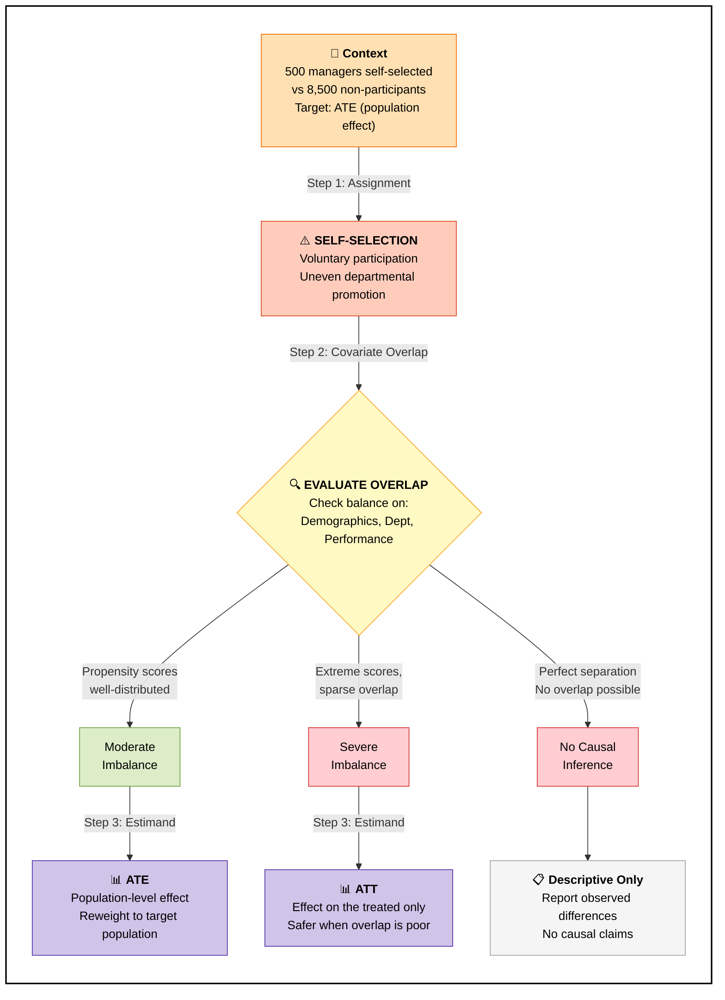
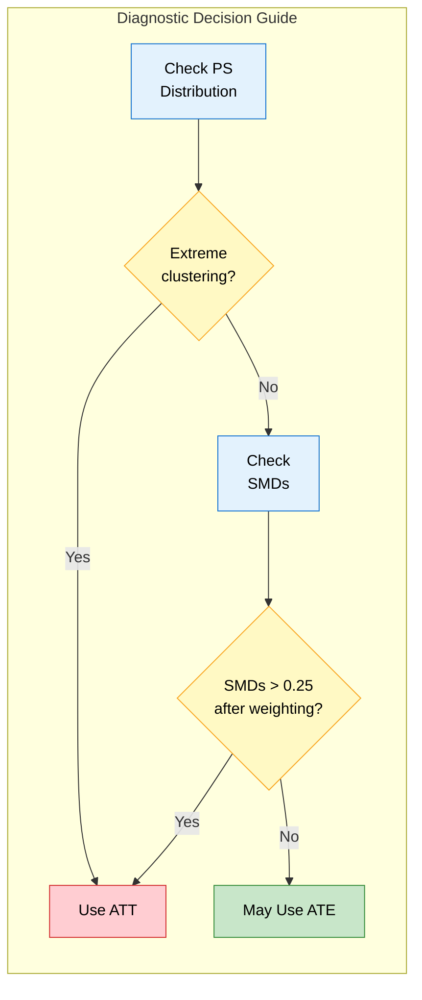

### Decision Flow

```mermaid
flowchart TB
    subgraph main[" "]
        direction TB

        S2["🎯 <b>Context</b><br/>500 managers self-selected<br/>vs 8,500 non-participants<br/>Target: ATE (population effect)"]
        
        S2 -->|"Step 1: Assignment"| A2
        A2["⚠️ <b>SELF-SELECTION</b><br/>Voluntary participation<br/>Uneven departmental promotion"]
        
        A2 -->|"Step 2: Covariate Overlap"| COV2
        COV2{"🔍 <b>EVALUATE OVERLAP</b><br/>Check balance on:<br/>Demographics, Dept, Performance"}
        
        COV2 -->|"Propensity scores<br/>well-distributed"| MOD["Moderate<br/>Imbalance"]
        COV2 -->|"Extreme scores,<br/>sparse overlap"| SEV["Severe<br/>Imbalance"]
        COV2 -->|"Perfect separation<br/>No overlap possible"| NOCI["No Causal<br/>Inference"]
        
        MOD -->|"Step 3: Estimand"| EST2A
        EST2A["📊 <b>ATE</b><br/>Population-level effect<br/>Reweight to target population"]
        
        SEV -->|"Step 3: Estimand"| EST2B
        EST2B["📊 <b>ATT</b><br/>Effect on the treated only<br/>Safer when overlap is poor"]
        
        NOCI --> DESC
        DESC["📋 <b>Descriptive Only</b><br/>Report observed differences<br/>No causal claims"]
    end

    style main fill:#ffffff,stroke:#000000,stroke-width:2px
    style S2 fill:#ffe0b2,stroke:#ef6c00,color:#000
    style A2 fill:#ffccbc,stroke:#d84315,color:#000
    style COV2 fill:#fff9c4,stroke:#f9a825,color:#000
    style MOD fill:#dcedc8,stroke:#689f38,color:#000
    style SEV fill:#ffcdd2,stroke:#d32f2f,color:#000
    style NOCI fill:#ffcdd2,stroke:#d32f2f,color:#000
    style EST2A fill:#d1c4e9,stroke:#512da8,color:#000
    style EST2B fill:#d1c4e9,stroke:#512da8,color:#000
    style DESC fill:#f5f5f5,stroke:#9e9e9e,color:#000
```

### Diagnostic Decision Guide

```mermaid
flowchart LR
    subgraph DIAG["Diagnostic Decision Guide"]
        D1["Check PS<br/>Distribution"] --> D2{"Extreme<br/>clustering?"}
        D2 -->|"Yes"| D3["Use ATT"]
        D2 -->|"No"| D4["Check<br/>SMDs"]
        D4 --> D5{"SMDs > 0.25<br/>after weighting?"}
        D5 -->|"Yes"| D3
        D5 -->|"No"| D6["May Use ATE"]
    end
    
    style D1 fill:#e3f2fd,stroke:#1976d2,color:#000
    style D2 fill:#fff9c4,stroke:#f9a825,color:#000
    style D3 fill:#ffcdd2,stroke:#d32f2f,color:#000
    style D4 fill:#e3f2fd,stroke:#1976d2,color:#000
    style D5 fill:#fff9c4,stroke:#f9a825,color:#000
    style D6 fill:#c8e6c9,stroke:#388e3c,color:#000
```

