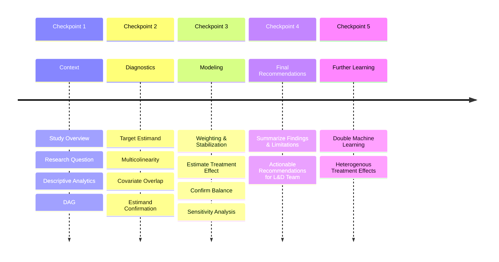
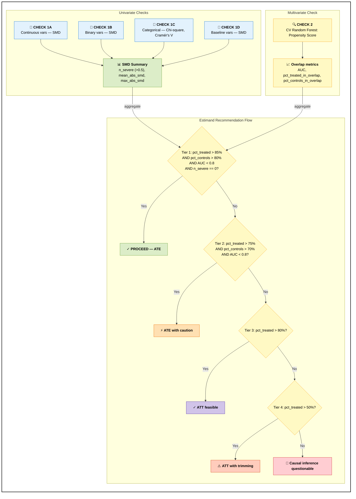

### Five-Checkpoint Learning Flow

```mermaid
timeline
    section Checkpoint 1
        Context: Study Overview : Research Question : Descriptive Analytics : DAG
    section Checkpoint 2
        Diagnostics : Target Estimand : Multicolinearity : Covariate Overlap : Estimand Confirmation
    section Checkpoint 3
        Modeling : Weighting & Stabilization : Estimate Treatment Effect : Confirm Balance : Sensitivity Analysis
    section Checkpoint 4
        Final Recommendations : Summarize Findings & Limitations : Actionable Recommendations for L&D Team
    section Checkpoint 5
        Further Learning : Double Machine Learning : Heterogenous Treatment Effects
```

### Overlap Diagnostics Logic Flow

Decision logic inside `check_covariate_overlap` and `run_overlap_diagnostics` (Group B diagnostics).

```mermaid
flowchart TB
    subgraph main[" "]
        direction TB

        subgraph univariate [Univariate Checks]
            Check1A["📐 <b>CHECK 1A</b><br/>Continuous vars — SMD"]
            Check1B["📐 <b>CHECK 1B</b><br/>Binary vars — SMD"]
            Check1C["📐 <b>CHECK 1C</b><br/>Categorical — Chi-square, Cramér's V"]
            Check1D["📐 <b>CHECK 1D</b><br/>Baseline vars — SMD"]
            Check1A --> SMDSummary
            Check1B --> SMDSummary
            Check1C --> SMDSummary
            Check1D --> SMDSummary
            SMDSummary["📊 <b>SMD Summary</b><br/>n_severe (>0.5), mean_abs_smd, max_abs_smd"]
        end

        subgraph multivariate [Multivariate Check]
            Check2["🔍 <b>CHECK 2</b><br/>CV Random Forest: Propensity Score"]
            Check2 --> OverlapPct["📈 <b>Overlap metrics</b><br/>AUC, pct_treated_in_overlap, pct_controls_in_overlap"]
        end

        SMDSummary -->|"aggregate"| T1
        OverlapPct -->|"aggregate"| T1

        subgraph tierLogic [Estimand Recommendation Flow]
            T1{"Tier 1: pct_treated > 85%<br/>AND pct_controls > 80%<br/>AND AUC < 0.8<br/>AND n_severe == 0?"}
            T1 -->|Yes| Tier1["✓ <b>PROCEED — ATE</b>"]
            T1 -->|No| T2{"Tier 2: pct_treated > 75%<br/>AND pct_controls > 70%<br/>AND AUC < 0.8?"}
            T2 -->|Yes| Tier2["⚡ <b>ATE with caution</b>"]
            T2 -->|No| T3{"Tier 3: pct_treated > 80%?"}
            T3 -->|Yes| Tier3["✓ <b>ATT feasible</b>"]
            T3 -->|No| T4{"Tier 4: pct_treated > 50%?"}
            T4 -->|Yes| Tier4["⚠️ <b>ATT with trimming</b>"]
            T4 -->|No| Tier5["🚨 <b>Causal inference questionable</b>"]
        end
    end

    style main fill:#ffffff,stroke:#000000,stroke-width:2px
    style Check1A fill:#e3f2fd,stroke:#1976d2,color:#000
    style Check1B fill:#e3f2fd,stroke:#1976d2,color:#000
    style Check1C fill:#e3f2fd,stroke:#1976d2,color:#000
    style Check1D fill:#e3f2fd,stroke:#1976d2,color:#000
    style SMDSummary fill:#dcedc8,stroke:#689f38,color:#000
    style Check2 fill:#fff9c4,stroke:#f9a825,color:#000
    style OverlapPct fill:#fff9c4,stroke:#f9a825,color:#000
    style T1 fill:#fff9c4,stroke:#f9a825,color:#000
    style T2 fill:#fff9c4,stroke:#f9a825,color:#000
    style T3 fill:#fff9c4,stroke:#f9a825,color:#000
    style T4 fill:#fff9c4,stroke:#f9a825,color:#000
    style Tier1 fill:#dcedc8,stroke:#689f38,color:#000
    style Tier2 fill:#ffe0b2,stroke:#ef6c00,color:#000
    style Tier3 fill:#d1c4e9,stroke:#512da8,color:#000
    style Tier4 fill:#ffccbc,stroke:#d84315,color:#000
    style Tier5 fill:#ffcdd2,stroke:#d32f2f,color:#000
```

